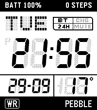

# PT2 W-221H

A watch face for the **Pebble Time 2** that imitates the look of the Casio W-221H:
a white LCD with slanted 7-segment digits, a dot-matrix weekday and a 2x2 indicator
box, between a black top bezel and bottom bezel.



Pebble Time 2 only (platform `emery`, 200x228 screen). Built and tested with Pebble SDK 4.33.1.

## What it shows

| Area | Content |
|---|---|
| Top bezel | Battery level and step count, or your own text instead of either (settings) |
| Weekday | Dot-matrix day name (SUN, MON, ...) |
| Indicator box | **BT** phone connected, **CHG** charging, **24H** 24-hour format, **MUTE** Quiet Time on. Active labels are dark, inactive ones faint |
| Time | Large slanted digits. A **P** lights up for PM in 12-hour mode |
| Date | DD-MM or MM-DD |
| Right box | Temperature (°C or °F) or seconds |
| Bottom bezel | A **WR** badge (or **HR** and your latest heart rate) and a text label |

Notes:

- Battery is reported by the watch in 10% steps, so it moves 100%, 90%, 80%, ...
- Steps come from Pebble Health. Heart rate is the latest reading the watch has; it shows `--` when there is none.
- Weather is fetched by the phone from [Open-Meteo](https://open-meteo.com) using its location, at start-up and every 30 minutes. It shows `--` if the data is more than 3 hours old.
- Unlit segments are drawn as a faint ghost, like a real LCD (can be switched off).
- The Time 2's backlight is colour-capable. By default the watch face leaves it at your normal system colour, but it can tint it instead (amber like the original's LED, or any of ten colours).

## Settings

Open the watch face's settings in the Pebble app. Nothing reaches the watch until you tap **Save**.
**Reset to defaults** puts every option back to the value below (then tap Save).

| Group | Option | Choices (default first) |
|---|---|---|
| Time & date | Time format | 24-hour, 12-hour |
| | Date format | DD-MM, MM-DD |
| Right box | Right box shows | Temperature, Seconds (redraws every second: uses more battery) |
| | Temperature unit | Celsius, Fahrenheit (only shown while the right box shows the temperature) |
| Top bezel | Show battery level | On. When off, the left text is shown instead |
| | Left text | `3 DAY BATTERY` (up to 19 characters, capitals; only shown while the battery level is off) |
| | Show step count | On. When off, the right text is shown instead |
| | Right text | `WR 3ATM` (up to 19 characters, capitals; only shown while the step count is off) |
| Bottom bezel | Show heart rate | Off. When on, the WR badge becomes HR with the latest heart rate |
| | Label | `PEBBLE` (up to 12 characters, capitals; empty for none) |
| Appearance | Case color | Black, Silver |
| | Show unlit segments | On, Off |
| | Backlight color | **System default** (your watch's normal colour), Amber, Warm white, Red, Orange, Yellow, Green, Cyan, Blue, Purple, Pink |
| Alerts | Vibrate on phone disconnect | Double pulse (None, Short, Long, Double, Triple, Heartbeat, SOS) |
| | Vibrate on phone reconnect | Short pulse (same patterns) |

There is no vibration during Quiet Time. When the two top-bezel texts are both long, the right
text takes the width it needs and the left one is cut with "..." to fit.

## Building and installing

You need the Pebble command-line tool and SDK (needs Python 3.10 or newer; Python 3.13 via `uv`
is what was used, because a system Python without `ensurepip` cannot create the SDK's virtualenv):

```sh
curl -LsSf https://astral.sh/uv/install.sh | sh          # installs uv
uv tool install pebble-tool --python 3.13
pebble sdk install latest                                # tested with SDK 4.33.1
```

Build (this also installs the JavaScript dependency, `pebble-clay`):

```sh
pebble build          # produces build/<folder name>.pbw
```

Run it in the emulator, and take a screenshot:

```sh
pebble install --emulator emery
pebble screenshot --emulator emery --no-open screenshot.png
```

Install on the real watch, from this computer, over Wi-Fi:

1. In the Pebble phone app, switch on **Developer Connection** and note the phone's IP address
   (also shown in the phone's Wi-Fi settings). Keep the app open. The phone and computer must
   be on the same network.
2. Run:

   ```sh
   pebble install --phone <phone-ip>
   ```

   "Connection refused" means Developer Connection is off (it switches off when the app is
   closed or the phone sleeps).

Or copy `build/*.pbw` to the phone and open it with the Pebble app. Allow the location permission
(for weather) and the health permission (for steps and heart rate) when asked.

## What the emulator can't check

The emulator has no Bluetooth link to a phone app, no coloured backlight, no real steps or heart
rate, and it cannot open the settings page. Those need the real watch: the connect/disconnect
vibrations, the backlight colours, live heart rate, and every control on the settings page.

## How it works

```
src/c/main.c          The watch app: drawing, settings, services
src/c/segments.h      The seven 7-segment outlines (generated, see below)
src/pkjs/index.js     Phone side: weather fetch (Open-Meteo) and the settings page
src/pkjs/config.js    The settings page layout, defaults and choices (Clay)
src/pkjs/custom-clay.js  Runs on the settings page: hides options that don't apply, Reset button
tools/gen_segments.py Regenerates segments.h from the 7-Segment font
package.json          App metadata, permissions, and the app-message keys
```

**Drawing.** Everything on the white LCD panel is rasterized straight into the framebuffer
(`draw_lcd()` in `main.c`), which allows what the normal drawing API can't:

- The digits are polygons (the segment outlines of the font, scaled to each digit's box). They are
  sheared by `LCD_SLANT` (7.5%, measured from a photo of the original) and, with `LCD_AA`, their edges
  are anti-aliased using the display's dark-gray and light-gray shades. A pixel is only ever darkened,
  so neighbouring segments never eat into each other.
- Unlit segments and dots ("ghosts") use an ordered dither whose density is `GHOST_DENSITY` (out of 16).
- The indicator box labels are drawn with the system font and then squashed in the framebuffer to
  8 pixels tall (dropping repeated rows, so horizontal bars keep their thickness); "BT" is also widened.
- The weekday is a 5x5 dot matrix, upright like the original. The bezel text uses the system fonts.

**Layout.** All positions are constants in the "Drawing" section of `main.c` (`LCD_*`, `BOX_*`,
`TIME_*`, `ROW3_*`, `TEMP_X`, `BOTTOM_CAP`). There is one function per screen area
(`draw_time`, `draw_date`, `draw_temperature`, `draw_indicator_frame`, `draw_top_bezel`, ...).

**Data flow.** The phone sends the temperature as the `Temp` message; the watch asks for a refresh
with `RequestWeather`. Settings from the settings page arrive as messages named after the
`messageKey`s in `config.js`, are copied into the `Settings` struct and saved with `persist_write_data`.
Ticks come once a minute, or every second when seconds are shown.

## Changing things

**Look:** the constants above; `LCD_SLANT` (0 = upright), `LCD_AA` (`false` turns smoothing off),
`GHOST_DENSITY` (higher = darker unlit segments; 8 is a checkerboard), `BT_WIDTHS` and `LABEL_H` for
the indicator labels.

**Adding a setting** (all five steps are needed):

1. Add the item to `src/pkjs/config.js` with a `messageKey` and a `defaultValue`.
2. Add the same key to `messageKeys` in `package.json`, then run `pebble clean` (the key
   constants are generated at build time and are stale otherwise).
3. Add a field to the `Settings` struct in `main.c`, its default in `init()`, and read it in
   `inbox_handler()`.
4. Increase `SETTINGS_KEY`. Saved settings from the old layout are then ignored (everyone's settings
   reset once), which is safer than misreading them. The same goes for `WEATHER_KEY` and `Weather`.
5. Use the value where it is drawn or acted on.

**Segment shapes:** `segments.h` is generated. To regenerate it:

```sh
curl -sLo /tmp/7segment.ttf https://torinak.com/font/7segment.ttf
python3 tools/gen_segments.py /tmp/7segment.ttf     # needs: pip install fonttools
```

**Checking a change without a watch:** build, install to the emulator and compare screenshots. Any
change that should not alter the picture (a refactor) can be verified by taking the same
screenshots before and after with the time, weather and settings forced to fixed values, and
comparing them pixel by pixel.

## Credits and licences

- The digit shapes are the segment outlines of the **7-Segment** font by **Jan Bobrowski**
  (<https://torinak.com/font/7-segment>), SIL Open Font License 1.1.
- The settings page uses **pebble-clay** (MIT). Weather data is from **Open-Meteo** (CC BY 4.0).
- Casio and W-221H are trademarks of Casio Computer Co., Ltd.; this watch face is an unofficial
  tribute and is not affiliated with Casio or Pebble.

Full details and licence texts: [`THIRD_PARTY_NOTICES.md`](THIRD_PARTY_NOTICES.md) and [`LICENSES/`](LICENSES/).

This project's own code is released under the [MIT licence](LICENSE). The third-party
parts above keep their own licences.
